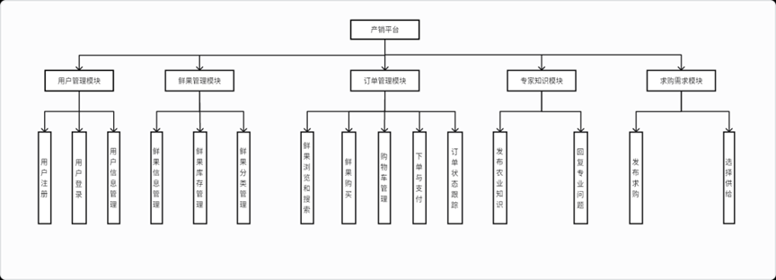
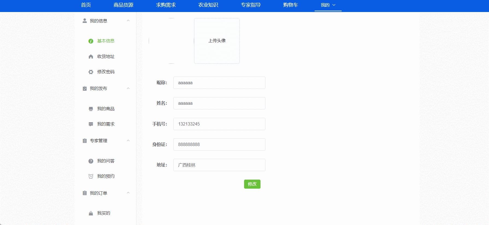

# fresh-fruit-supermarket🎂

基于SpringBoot+Vue的水果超市、鲜果超市、农产品产销、农产品销售系统

## 介绍🌞

> 在农产品领域中，尤其是鲜果产业，传统的销售模式已经很难满足日益增长的市场需求。消费者对于新鲜、优质的水果以及便捷的购买体验有着更高的期望，而生产者则面临着如何有效拓展销售渠道、提高产品附加值等问题挑战。本文设计并实现了一个基于SpringBoot框架的鲜果产销交互平台，旨在促进鲜果产业的产销对接，提高产销双方的沟通效率和市场响应速度。该平台通过整合鲜果供应商、批发商、零售商以及消费者等各方资源，实现信息的实时共享和交互，从而优化鲜果产业的供应链管理和市场营销。确保消费者拿到的是最优的水果，同时也解决了产家物资屯留、浪费等情况，确保精准供应。

## 软件架构🌞


## 项目演示🌞

**用户端**





**管理端**


## 安装教程🌞

```
1. 运行环境准备mysql8 + java8 + node14.16.1 + redis

2. 配置maven路径，加载依赖

3. 运行sql文件，确保application.yml或config.properties的数据库名称和账号密码是数据库所在主机的账号密码
```


## 使用说明🌞

```
1. 登入

		管理员账号：admin	密码：123456

    普通用户账号：zhangsan	密码：123456
  
2. 运行流程

SpringBoot+Vue项目的部署详情可以查看这篇CSDN博客：http://t.csdnimg.cn/kpuxS

前后端不分离项目的部署流程可以查看这篇CSDN博客：http://t.csdnimg.cn/CslA5
```


## CSDN项目合集🌞

点击前往：http://t.csdnimg.cn/Q4u84

## 联系我🌞

**有偿获取完整源码或调试代码**

🐧：1902317191

we-chat：coding1902317191
